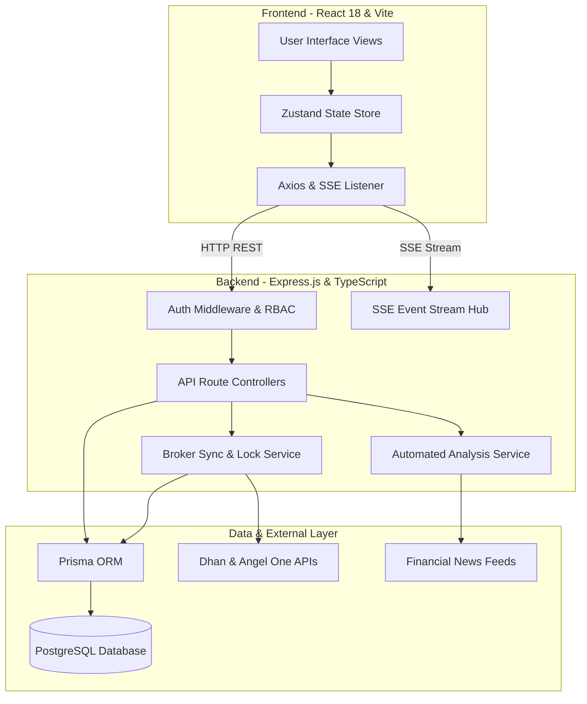
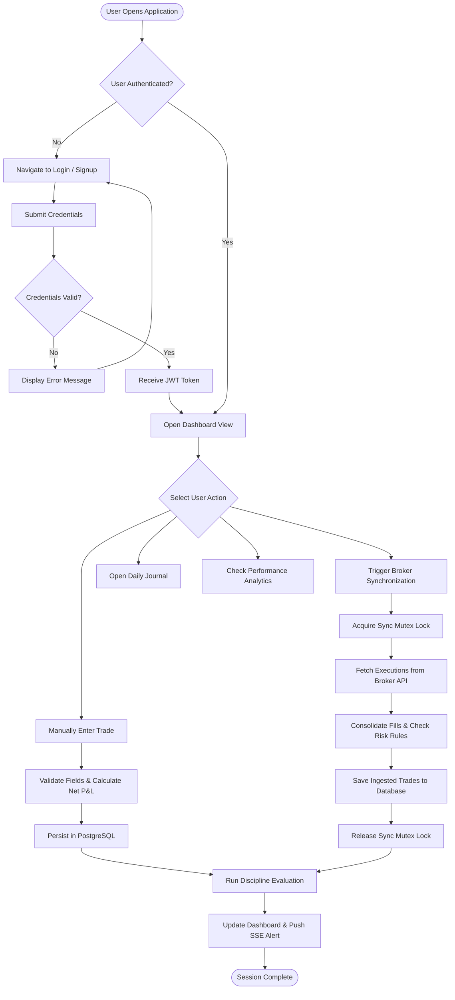
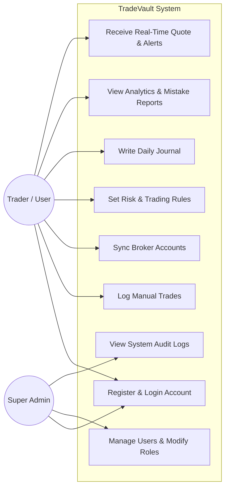
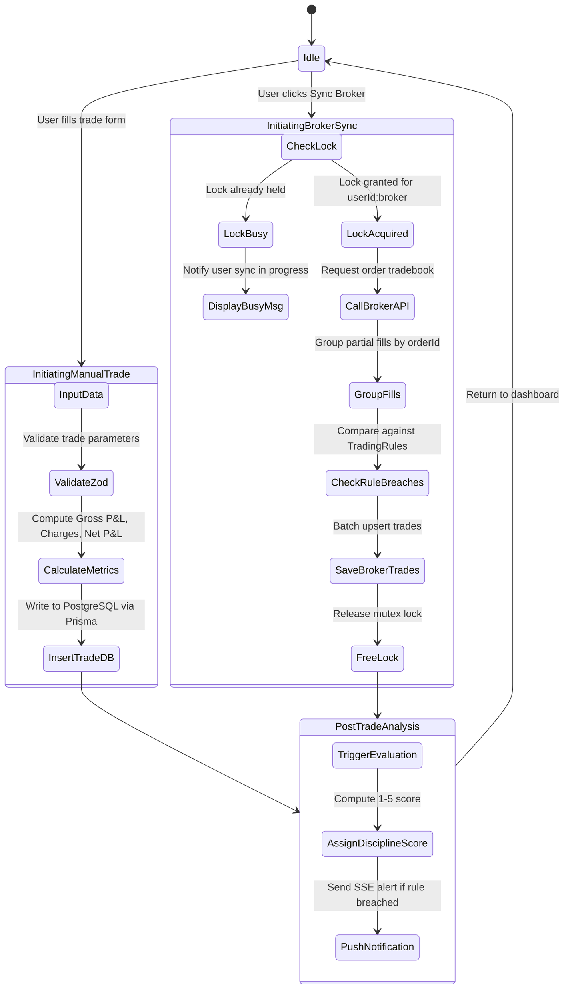
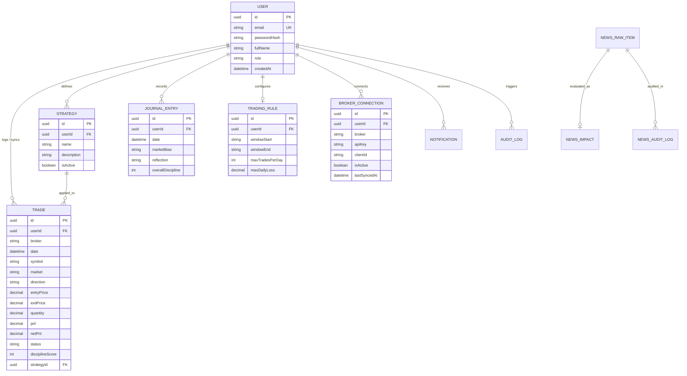

# Summer Internship Project (SIP) Master Documentation

## 1. Internship Overview

### 1.1 Project Title
**TradeVault: Automated Trading Journal, Discipline Analytics and Market Information System**

### 1.2 Internship Organization
`Not Available` *(Placeholder: Organization Name to be specified by the student)*

### 1.3 Organization Location
`Not Available` *(Placeholder: Organization Address / City to be specified by the student)*

### 1.4 Internship Duration (60 Days)
* **Duration:** 60 Days (8–9 Weeks)
* **Academic Period:** Summer Internship / Capstone Period
* **Academic Year / Session:** 2024–2026 Batch
* **Institution:** Srusti Academy of Management and Technology (Autonomous), Bhubaneswar
* **Affiliating Body / Department:** Department of Master of Computer Applications (MCA)

### 1.5 Student Details
* **Student Name:** `[Student Name - Placeholder]`
* **Roll Number / Registration Number:** `[Registration Number - Placeholder]`
* **Academic Program:** Master of Computer Applications (MCA)
* **Semester:** MCA Final Year / Internship Semester
* **College:** Srusti Academy of Management and Technology (Autonomous), Bhubaneswar

### 1.6 Internal Guide
* **Name:** `[Internal Guide Name - Faculty Member]`
* **Designation:** `[Designation / Department of Computer Applications]`
* **Institution:** Srusti Academy of Management and Technology (Autonomous), Bhubaneswar

### 1.7 External Guide
* **Name:** `[External Guide Name - Industry Mentor]`
* **Designation:** `[Designation - Senior Software Engineer / Technical Lead]`
* **Organization:** `[Host Organization Name]`

### 1.8 Project Role
* **Role / Designation:** Full Stack Software Engineering Intern
* **Department:** Software Development / Engineering Division
* **Core Responsibilities:** 
  * Requirements analysis and database design.
  * Backend API development and broker API integration.
  * Frontend component implementation and state management.
  * System testing, design token validation, and documentation.

### 1.9 Internship Summary
During the 60-day internship, the student worked as a Full Stack Software Engineering Intern to design and develop **TradeVault**, a web-based trading journal and analytics application. The software provides automated trade synchronization with stock brokerage accounts (Dhan and Angel One), deterministic risk rule checking, post-trade discipline evaluation, real-time market quote feeds via Server-Sent Events, and structured financial news categorization. The project was built using React, TypeScript, Node.js, Express, Prisma ORM, and PostgreSQL under the technical guidance of the organization's engineering team.

---

## 2. Organization Profile

### 2.1 About the Organization
`Not Available` *(Note: To be filled from company profile provided by the internship organization)*

### 2.2 Vision and Mission
* **Vision:** `Not Available`
* **Mission:** `Not Available`

### 2.3 Services / Products
* Software application development and custom enterprise solutions.
* Financial data tools, analytics, and software integration services.
* Web and cloud-based application maintenance and modernization.

### 2.4 Organizational Structure
`Not Available` *(Note: Standard hierarchy consists of Technical Director $\rightarrow$ Project Manager $\rightarrow$ Senior Technical Leads $\rightarrow$ Software Engineers $\rightarrow$ Interns)*

### 2.5 Technology Environment
* **Operating Systems:** Windows 10/11, Linux (Ubuntu/Debian)
* **Development Environments:** Visual Studio Code, Node.js runtime, PostgreSQL database server
* **Version Control:** Git version control system
* **Collaboration & Testing:** Postman API client, Node test runner, internal code review workflows

---

## 3. Objectives of Internship

### 3.1 Technical Objectives
* To design and implement a full-stack client-server architecture using modern web technologies (React, Express, TypeScript, PostgreSQL).
* To design a normalized relational database schema (3NF) managed via Prisma ORM for financial records and user activity.
* To integrate external third-party REST APIs (brokerage APIs) and handle asynchronous data synchronization.
* To build real-time communication channels using Server-Sent Events (SSE) for market telemetry and user notifications.
* To implement secure authentication using JSON Web Tokens (JWT) and Role-Based Access Control (RBAC).

### 3.2 Learning Objectives
* To gain practical hands-on experience in full-stack software development within a professional industry environment.
* To understand the complete Software Development Life Cycle (SDLC), from requirements gathering to testing and deployment preparation.
* To learn how to write clean, modular, and maintainable TypeScript code with strict type validation.
* To understand API security principles, input sanitization with Zod, and data isolation in multi-user applications.

### 3.3 Professional Skill Development Goals
* To develop effective technical communication and collaborative problem-solving skills with team members and mentors.
* To adhere to software engineering coding standards, directory conventions, and Git version control practices.
* To improve analytical thinking and debugging capabilities when handling concurrent execution flows and network integrations.
* To build time management and sprint execution discipline within a structured 60-day internship schedule.

---

## 4. Technologies and Tools Used

| Category | Technology / Tool | Version | Purpose in Project |
| :--- | :--- | :--- | :--- |
| **Programming Language** | TypeScript | 5.5.3 | Static typing across frontend client and backend server |
| **Frontend Framework** | React | 18.3.1 | Component-based user interface rendering |
| **Build Tool** | Vite | 5.4.2 | Development server and single-page application bundler |
| **State Management** | Zustand | 4.5.5 | Centralized client-side state store |
| **Styling & CSS** | TailwindCSS & CSS Tokens | 3.4.1 | UI styling, responsive layouts, and CSS custom properties |
| **Charting Library** | Lightweight Charts | 4.2.1 | Candlestick and financial line chart visualization |
| **Icons Suite** | Lucide React | 0.344.0 | SVG icons for interface navigation |
| **Backend Runtime** | Node.js | 20.x LTS | Server runtime environment |
| **Backend Framework** | Express.js | 4.19.2 | REST API routing and middleware management |
| **Database ORM** | Prisma | 5.19.1 | Type-safe database queries and automated schema migrations |
| **Database Engine** | PostgreSQL | 16.x | Relational database storage |
| **Cache / Fast Store** | Redis & In-Memory Fallback | 4.7.0 | Response caching and rate-limiting store |
| **Authentication** | JWT & bcryptjs | 9.0.2 / 2.4.3 | Stateless token authentication and password hashing |
| **Validation Library** | Zod | 3.23.8 | API payload runtime schema validation |
| **Streaming Protocol** | Server-Sent Events (SSE) | HTTP/1.1 | Real-time quote feeds and notification push |
| **External Broker APIs**| Dhan HQ v2 & Angel One | Custom REST | Automated trade synchronization protocols |
| **Analysis Engine** | Intelligent Evaluation Service | Cloud SDK | Automated trade discipline scoring and news categorization |
| **Development Tools** | VS Code, Postman | Latest | Code editing, debugging, and API testing |

---

## 5. Work Carried Out / Project Details

### 5.1 Project Background
Financial market trading involves detailed tracking of executions, compliance with personal risk rules, and regular performance review. Most retail market participants rely on manual spreadsheets or physical notebooks, leading to incomplete records, lack of risk rule enforcement, and emotional trading mistakes. TradeVault was initiated to provide an automated, centralized web platform where traders can log trades, synchronize broker executions, monitor risk limits, and receive objective feedback.

### 5.2 Problem Statement
1. **Manual Record Keeping Overhead:** Entering trade details manually into spreadsheets is time-consuming and leads to missing trade data, inaccurate calculations of statutory charges, and incorrect net P&L.
2. **Lack of Risk Rule Enforcement:** Traders frequently violate risk guidelines (such as exceeding maximum daily loss or trading outside set market hours) because manual systems cannot alert them in real time.
3. **Multi-Broker Account Silos:** Traders using more than one broker struggle to consolidate trades, calculate net portfolio metrics, and identify behavioral mistakes across platforms.
4. **Unstructured Market Information:** Financial news feeds contain excessive sensationalism without clear categorization into affected market sectors.

### 5.3 Scope of the Project
* Automated and manual trade logging for Equity, Futures, Options, and Commodities.
* Secure credential storage and automated order synchronization with Dhan and Angel One broker APIs.
* Risk rule configuration (daily loss caps, max trades per day, trading time windows) with automated breach detection.
* Automated post-trade discipline evaluation scoring trades on a scale of 1 to 5.
* Real-time market telemetry streaming and sector-based financial news categorization.
* Centralized analytics dashboard with mistake analysis, session heatmaps, and win-rate statistics.
* Multi-tier administrative user management and audit logging.

### 5.4 Modules Developed
1. **User Authentication & RBAC Module:** Handles user signup, login, JWT token issuance, password hashing via bcrypt, and role authorization (`USER`, `SUB_ADMIN`, `ADMIN`, `SUPER_ADMIN`).
2. **Trade Management Module:** Full CRUD operations for trade records, automated calculation of charges and net P&L, strategy association, and qualitative execution notes.
3. **Broker Integration & Sync Module:** Connects to Dhan HQ and Angel One APIs to fetch daily executions and convert raw fills into consolidated trade records. Includes a concurrency lock to prevent duplicate syncs.
4. **Discipline & Risk Evaluation Module:** Compares trades against user-configured trading rules and runs automated evaluation routines to assign behavioral discipline scores and mistake tags.
5. **Daily Journal & Reflection Module:** Daily market diary capturing pre-market bias, key levels, trade reflections, emotional state, and discipline ratings.
6. **Market Watch & News Module:** Streams live market quotes via SSE, displays candlestick charts, and categorizes incoming financial news into market sectors.
7. **Analytics & Diagnostics Module:** Computes aggregated performance statistics (win rate, profit factor, mistake breakdown, hourly performance) and displays system health metrics.
8. **Administration Module:** Super Admin dashboard for monitoring platform user metrics, managing user roles, and viewing administrative audit logs.

### 5.5 Tasks Assigned During Internship
* **Weeks 1–2 (Days 1–10):** Study project requirements; analyze database requirements; design Prisma relational schema; configure PostgreSQL environment.
* **Weeks 3–4 (Days 11–20):** Implement Node.js/Express server; set up TypeScript configuration; build JWT authentication routes and RBAC middleware.
* **Weeks 5–6 (Days 21–30):** Develop trade and journal CRUD API controllers; implement broker API integration adapters (Dhan and Angel One) and synchronization lock service.
* **Weeks 7–8 (Days 31–40):** Build automated trade evaluation module and sector news processing pipeline; integrate real-time SSE streaming for market quotes and notifications.
* **Weeks 9–10 (Days 41–50):** Develop frontend user interface in React with TailwindCSS; build Dashboard, Trades Table, Journal Calendar, and Analytics pages; integrate Zustand stores.
* **Weeks 11–12 (Days 51–60):** Implement Admin portal; execute end-to-end automated test cases (82 tests); perform design token validation; compile project documentation and internship report.

### 5.6 Methodology Adopted
The project followed an **Agile / Iterative Development Methodology** consisting of 2-week sprint cycles:
* **Sprint Planning:** Requirement breakdown and database modeling at the start of each iteration.
* **Daily Development:** Incremental implementation of backend routes followed by corresponding frontend views.
* **Review & Testing:** Verification of endpoints using Postman and automated test scripts at the end of each sprint.
* **Refactoring:** Continuous refinement of code structure, type definitions, and error handling.

### 5.7 System Workflow
1. The user logs in to the application and receives a JWT token.
2. The user configures personal risk rules (max loss limit, allowed trading window, max daily trades).
3. The user either enters trades manually or triggers automated synchronization from a connected broker account.
4. When broker sync is triggered, the backend acquires a sync lock, fetches order executions from the broker API, groups partial fills, calculates charges and net P&L, and checks for rule violations.
5. Ingested trades are stored in PostgreSQL and evaluated by the automated discipline evaluation module.
6. Real-time market quotes and risk alert notifications are streamed to the client interface via Server-Sent Events.
7. The user reviews daily journal entries, analytics charts, and mistake breakdowns to improve trading consistency.

### 5.8 Design and Implementation Details
* **Frontend Architecture:** Component-based SPA using React 18 and Vite. Routing is handled by React Router DOM with protected route wrappers. State is managed by dedicated Zustand stores (`authStore`, `tradeStore`, `journalStore`, `marketStore`, `notificationStore`).
* **Backend Architecture:** RESTful Express server written in TypeScript. Middleware pipeline handles CORS, JSON parsing, Morgan logging, JWT validation, and RBAC enforcement.
* **Concurrency Handling:** Synchronous broker ingestion jobs use an in-memory lock service (`lockService.ts`) keyed by `userId:broker` to prevent concurrent sync operations from creating duplicate trade rows.

### 5.9 Database Overview
The database uses PostgreSQL 16 managed via Prisma ORM. The relational model contains 20 tables:
* `users`: Stores user identity, hashed passwords, display name, and role.
* `trades`: Stores trade records with entry/exit price, quantity, net P&L, charges, status, and discipline scores.
* `broker_connections`: Stores broker API keys, client IDs, and sync timestamps.
* `trading_rules`: Stores user-configured risk thresholds (window start/end, max loss, max trades).
* `strategies`: Stores custom user trading strategies.
* `journal_entries`: Stores daily market reflections, bias, and emotional state.
* `news_raw_items`, `news_impact`, `news_audit_logs`: Stores incoming news, sector classifications, and compliance logs.
* `notifications`: Stores user alerts and risk breach notices.
* `audit_logs`: Stores administrative actions performed by super admins.

### 5.10 API Integration Overview
* **Dhan HQ Open API (v2):** Used to retrieve executed orders via REST endpoints using API client keys.
* **Angel One SmartAPI:** Used to authenticate trading sessions via TOTP and retrieve tradebook entries.
* **Server-Sent Events (SSE):** Internal streaming endpoints (`/api/market/stream` and `/api/notifications/stream`) pushing live updates to connected browser clients.

### 5.11 Testing Performed
* **Automated E2E Test Suite (`tests/e2e/run_tests.ts`):** 82 test cases executed against an in-memory mock server across 4 tiers:
  * *Tier 1: Feature Coverage (35 tests)* — CRUD operations for trades, journal, strategies, goals.
  * *Tier 2: Boundary & Corner Cases (20 tests)* — Zero quantities, negative values, leap year dates, empty query parameters.
  * *Tier 3: Security & RBAC (15 tests)* — Token expiration, invalid headers, role permission barriers, tenant isolation.
  * *Tier 4: Concurrency & Fault Tolerance (12 tests)* — Lock contention, client disconnection, error recovery.
* **Design Token Validation (`tests/validate-tokens.js`):** Verifies that all CSS custom variables defined in `src/index.css` resolve properly against Tailwind utility configurations.

### 5.12 Deployment Status
* **Local Development Environment:** Verified and running on Node.js 20.x, Express server (Port 3000), Vite client (Port 5173), and PostgreSQL database.
* **Cloud Deployment Status:** Ready for cloud deployment (Frontend on Vercel/Netlify; Backend on Node.js hosting / Render; Database on Neon Serverless PostgreSQL).

---

## 6. Screenshots and UI Inventory

| Screen Name | Route Path | Purpose | Major UI Elements | Screenshot Placeholder |
| :--- | :--- | :--- | :--- | :--- |
| **Login Screen** | `/login` | User authentication | Email input, password input, login button, signup link | `login_screen.png` |
| **User Registration** | `/signup` | New account registration | Name, email, password fields, register button | `signup_screen.png` |
| **Dashboard Overview** | `/app` | Main performance dashboard | Net P&L card, win rate gauge, active trades list, recent notifications | `dashboard_overview.png` |
| **Trade Log & Entry** | `/app/trades` | View and log trade executions | Searchable trades table, filter bar, manual trade entry modal, discipline badge | `trade_log_screen.png` |
| **Daily Journal** | `/app/journal` | Daily market reflections | Calendar date picker, market bias selector, reflection text area, mood tags | `journal_screen.png` |
| **Analytics Dashboard** | `/app/analytics` | Performance statistics | Mistake distribution chart, session-hour heatmap, risk expectancy stats | `analytics_screen.png` |
| **Markets & News** | `/app/markets` | Live quotes and news feed | Ticker bar, TradingView candlestick chart, sector-classified news cards | `markets_news_screen.png` |
| **Automated Coach** | `/app/ai-coach` | Interactive performance review | Chat message history, trade context sidebar, prompt input box | `ai_coach_screen.png` |
| **Trading Strategies** | `/app/strategies` | Strategy management | Strategy card grid, win-rate indicators, new strategy modal | `strategies_screen.png` |
| **Discipline Goals** | `/app/goals` | Habit and discipline tracking | Goal checklist, daily completion streak counter, progress bar | `goals_screen.png` |
| **Settings & Risk Rules** | `/app/settings` | Broker and rule settings | Broker API credentials form, max loss inputs, trading window sliders | `settings_screen.png` |
| **System Health** | `/app/system-health` | Diagnostic telemetry | Database status, server uptime, API latency monitor | `system_health_screen.png` |
| **Admin Overview** | `/app/admin` | Platform administrative overview | Total users metric, system volume chart, aggregate trade counter | `admin_overview.png` |
| **Admin User Directory**| `/app/admin/users` | User management | User table, role dropdown (`USER`/`ADMIN`/`SUPER_ADMIN`), delete button | `admin_users_screen.png` |
| **Admin Audit Logs** | `/app/admin/audit` | Platform audit history | Audit log table, timestamp filter, admin action details | `admin_audit_screen.png` |

---

## 7. Diagrams and Visual Documentation

### 7.1 System Architecture Diagram



### 7.2 Project Workflow Flowchart



### 7.3 Use Case Diagram



### 7.4 Activity Diagram (Trade Logging & Synchronization)



### 7.5 Entity-Relationship (ER) Diagram



---

## 8. Learning Outcomes

### 8.1 Technical Skills Gained
* **Full-Stack Application Development:** Mastered building end-to-end web applications with React on the frontend and Express.js on the backend using TypeScript.
* **Database Architecture & ORM:** Gained practical proficiency in relational database modeling, writing schema migrations, and executing type-safe queries using Prisma and PostgreSQL.
* **API Integration & Concurrency:** Learned how to consume third-party financial brokerage APIs, handle token-based authentication (TOTP), and implement in-memory lock primitives to prevent race conditions.
* **Real-Time Data Streaming:** Acquired hands-on experience in implementing HTTP Server-Sent Events (SSE) for pushing telemetry and notifications to the browser without WebSocket overhead.

### 8.2 Industry Exposure
* Experienced the software development lifecycle within a structured company engineering environment.
* Learned the importance of strict type safety, input validation schemas (Zod), and robust error handling in production code.
* Understood the security and isolation principles necessary when developing multi-tenant software systems.

### 8.3 Teamwork and Communication Skills
* Participated in sprint planning, code review sessions, and technical discussions with industry mentors.
* Improved ability to write structured technical documentation, code comments, and progress reports.
* Learned how to translate business and domain requirements into concrete database schemas and API endpoints.

### 8.4 Practical Knowledge Acquired
* Gained domain knowledge regarding financial market mechanisms, order execution types, brokerage charge calculations, and trader discipline principles.
* Understood defensive programming practices, including graceful error fallbacks, database transaction handling, and automated test writing.

---

## 9. Challenges Faced

1. **Broker Execution Consolidation:** Broker APIs return individual fill events for a single trade order. Consolidating partial executions into a single trade with a weighted average price and accurate turnover charges was technically complex.
2. **Race Conditions in Synchronous Broker Ingestion:** Simultaneous user clicks or rapid sync requests caused multiple worker executions, creating duplicate trade rows in the database.
3. **Session Token Expiry:** Broker API session tokens expire periodically, causing automated background synchronization calls to fail unexpectedly.
4. **Validating Dynamic JSON Payloads:** Ensuring that automated evaluation routines consistently return valid, structured data without type errors or unexpected keys.
5. **Managing Real-Time Connection Timeouts:** Network proxies and browsers occasionally terminate idle SSE connections, resulting in dropped notifications.

---

## 10. Solutions Adopted

1. **Order Aggregation Algorithm:** Developed a helper algorithm in `lib/brokers/` that groups executions by `orderId`, computes volume-weighted average price (VWAP), calculates statutory charges, and stores a unified trade record.
2. **Distributed Mutex Lock Service:** Implemented an asynchronous key-based lock (`lockService.ts`) keyed by `userId:broker` that checks and acquires an exclusive lock before proceeding with sync, rejecting overlapping requests.
3. **Automated TOTP Re-Authentication:** Embedded a session refresh routine (`loginAngelOne`) that uses stored credentials and client TOTP secrets to automatically request new JWT tokens upon detecting an authentication failure.
4. **Strict Schema Validation with Zod:** Enforced runtime schema validation on all incoming API payloads and analytical responses before database writes.
5. **SSE Heartbeat Keep-Alive:** Implemented a 30-second interval heartbeat ping (`: heartbeat\n\n`) on all active SSE streams to keep network connections alive, paired with auto-reconnection logic on the client.

---

## 11. Conclusion Notes

* **Project Completion Status:** The TradeVault application was successfully designed, developed, and tested during the 60-day internship period according to all assigned specifications.
* **Knowledge Gained:** The internship provided practical experience in modern web engineering, database design, API security, and real-time data streaming.
* **Confidence Developed:** Successfully building and validating a 20-model relational full-stack system built confidence in independently developing complex software projects.
* **Career Relevance:** The practical skills acquired in TypeScript, React, Node.js, and PostgreSQL directly align with industry requirements for Full Stack Software Engineer roles.

---

## 12. References

1. **React Documentation:** Official React 18 Library Reference. *https://react.dev/*
2. **Express.js Documentation:** Express Web Application Framework Reference. *https://expressjs.com/*
3. **Prisma ORM Guide:** Prisma Client and Schema Documentation. *https://www.prisma.io/docs/*
4. **PostgreSQL 16 Manual:** PostgreSQL Relational Database Documentation. *https://www.postgresql.org/docs/16/*
5. **TypeScript Handbook:** Official TypeScript Language Reference. *https://www.typescriptlang.org/docs/*
6. **Dhan HQ API v2 Documentation:** Dhan Developer Documentation for Orders and Trades. *https://dhanhq.co/docs/v2/*
7. **Angel One SmartAPI Documentation:** Angel One Developer Documentation. *https://smartapi.angelbroking.com/*
8. **Zod Documentation:** TypeScript-first schema validation with static type inference. *https://zod.dev/*

---

## 13. Appendix Material

### 13.1 Project Folder Structure

```
tradevault/
├── journal/
│   ├── package.json                  # Frontend dependencies and build scripts
│   ├── vite.config.ts                # Vite bundler configuration
│   ├── tailwind.config.js            # TailwindCSS theme configuration
│   ├── tsconfig.json                 # TypeScript compiler configuration
│   ├── src/                          # Frontend source code
│   │   ├── App.tsx                   # Main router and route definitions
│   │   ├── main.tsx                  # React DOM entry point
│   │   ├── index.css                 # CSS variables and base styles
│   │   ├── components/               # UI components (Header, Sidebar, Modals, Tables)
│   │   ├── pages/                    # Page views (Dashboard, Trades, Journal, Analytics)
│   │   ├── stores/                   # Zustand state stores (authStore, tradeStore)
│   │   └── lib/                      # Client utilities and Axios instance
│   ├── server/                       # Backend source code
│   │   ├── package.json              # Server dependencies and scripts
│   │   ├── tsconfig.json             # Server TypeScript configuration
│   │   ├── prisma/
│   │   │   └── schema.prisma         # PostgreSQL schema definition (20 models)
│   │   └── src/
│   │       ├── index.ts              # Express server entry point
│   │       ├── db.ts                 # Prisma client instance
│   │       ├── middleware/           # Auth and RBAC middleware
│   │       ├── routes/               # API route controllers (trades, auth, brokers)
│   │       ├── lib/                  # Broker adapters and evaluation helpers
│   │       └── services/             # Lock service and notification service
│   └── tests/                        # Automated test suites
│       ├── validate-tokens.js        # Design token validator script
│       └── e2e/                      # 82-case automated E2E test suite
```

### 13.2 Important Code Snippets

#### Authentication Middleware (`server/src/middleware/auth.ts`)
```typescript
import { Request, Response, NextFunction } from 'express';
import jwt from 'jsonwebtoken';

export interface AuthRequest extends Request {
  userId?: string;
  userRole?: string;
}

export const authenticate = (req: AuthRequest, res: Response, next: NextFunction) => {
  const authHeader = req.headers.authorization;
  if (!authHeader || !authHeader.startsWith('Bearer ')) {
    return res.status(401).json({ error: 'Unauthorized: Missing or invalid token' });
  }

  const token = authHeader.split(' ')[1];
  try {
    const decoded = jwt.verify(token, process.env.JWT_SECRET || 'tradevault-secret') as any;
    req.userId = decoded.userId || decoded.id;
    req.userRole = decoded.role || 'USER';
    next();
  } catch (error) {
    return res.status(401).json({ error: 'Unauthorized: Invalid token' });
  }
};

export const requireRoles = (roles: string[]) => {
  return (req: AuthRequest, res: Response, next: NextFunction) => {
    if (!req.userRole || !roles.includes(req.userRole)) {
      return res.status(403).json({ error: 'Forbidden: Insufficient permissions' });
    }
    next();
  };
};
```

#### Mutex Synchronization Lock (`server/src/services/lockService.ts`)
```typescript
class LockService {
  private syncLocks: Map<string, number> = new Map();
  private readonly LOCK_TIMEOUT_MS = 60000; // 60 seconds

  public acquireSyncLock(userId: string, broker: string): boolean {
    const key = `${userId}:${broker}`;
    const now = Date.now();
    const existingLockTime = this.syncLocks.get(key);

    if (existingLockTime && now - existingLockTime < this.LOCK_TIMEOUT_MS) {
      return false; // Lock already held
    }

    this.syncLocks.set(key, now);
    return true;
  }

  public releaseSyncLock(userId: string, broker: string): void {
    const key = `${userId}:${broker}`;
    this.syncLocks.delete(key);
  }
}

export const lockService = new LockService();
```

#### Core Trade Model (`server/prisma/schema.prisma`)
```prisma
model Trade {
  id                String    @id @default(uuid())
  userId            String
  user              User      @relation(fields: [userId], references: [id], onDelete: Cascade)
  broker            String    @default("manual")
  brokerTradeId     String?
  date              DateTime
  symbol            String
  market            String    @default("NSE")
  instrumentType    String    @default("EQUITY")
  direction         String?
  entryPrice        Decimal?  @db.Decimal(15, 4)
  exitPrice         Decimal?  @db.Decimal(15, 4)
  quantity          Decimal?  @db.Decimal(15, 4)
  pnl               Decimal?  @db.Decimal(15, 4)
  charges           Decimal?  @db.Decimal(15, 4)
  netPnl            Decimal?  @db.Decimal(15, 4)
  status            String?
  strategyId        String?
  strategy          Strategy? @relation(fields: [strategyId], references: [id], onDelete: SetNull)
  disciplineScore   Int?
  mistakes          String[]  @default([])
  createdAt         DateTime  @default(now())
  updatedAt         DateTime  @updatedAt

  @@index([userId, date])
}
```

### 13.3 Configuration Files

#### Frontend Dependencies (`package.json`)
```json
{
  "name": "journal",
  "private": true,
  "version": "0.0.0",
  "type": "module",
  "scripts": {
    "dev": "vite",
    "build": "tsc && vite build",
    "preview": "vite preview"
  },
  "dependencies": {
    "axios": "^1.7.9",
    "lightweight-charts": "^4.2.1",
    "lucide-react": "^0.344.0",
    "react": "^18.3.1",
    "react-dom": "^18.3.1",
    "react-router-dom": "^6.26.0",
    "zustand": "^4.5.5"
  },
  "devDependencies": {
    "tailwindcss": "^3.4.1",
    "typescript": "^5.5.3",
    "vite": "^5.4.2"
  }
}
```

#### Backend Dependencies (`server/package.json`)
```json
{
  "name": "tradevault-server",
  "version": "1.0.0",
  "main": "dist/index.js",
  "scripts": {
    "build": "tsc",
    "start": "node dist/index.js",
    "dev": "tsx watch src/index.ts"
  },
  "dependencies": {
    "@prisma/client": "^5.19.1",
    "bcryptjs": "^2.4.3",
    "cors": "^2.8.5",
    "express": "^4.19.2",
    "jsonwebtoken": "^9.0.2",
    "zod": "^3.23.8"
  },
  "devDependencies": {
    "prisma": "^5.19.1",
    "typescript": "^5.5.3"
  }
}
```

### 13.4 Screenshot File List
* `fig_6_1_login_screen.png` — User Login Interface
* `fig_6_2_signup_screen.png` — User Registration Screen
* `fig_6_3_dashboard_overview.png` — Main Trading Dashboard Overview
* `fig_6_4_trades_table.png` — Searchable Trade Log Table and Entry Modal
* `fig_6_5_journal_screen.png` — Daily Trading Journal and Reflection Form
* `fig_6_6_analytics_screen.png` — Performance Analytics and Mistake Chart
* `fig_6_7_markets_screen.png` — Market Telemetry and Sector News Cards
* `fig_6_8_ai_coach.png` — Automated Analysis Coach Chat Screen
* `fig_6_9_settings_rules.png` — Broker Setup and Risk Rule Configuration
* `fig_6_10_admin_overview.png` — Super Admin User and Audit Management Screen

---

# EVIDENCE MAPPING

| Major Claim / Implementation | Source File Evidence in Codebase |
| :--- | :--- |
| **React 18 & TypeScript Frontend** | `journal/package.json`, `journal/src/main.tsx` |
| **Vite Single Page Application** | `journal/vite.config.ts` |
| **TailwindCSS Styling System** | `journal/tailwind.config.js`, `journal/src/index.css` |
| **Zustand Central State Stores** | `journal/src/stores/authStore.ts`, `tradeStore.ts` |
| **Express.js Backend Server** | `journal/server/package.json`, `server/src/index.ts` |
| **Prisma Relational Database Schema** | `journal/server/prisma/schema.prisma` |
| **JWT Authentication & RBAC** | `journal/server/src/middleware/auth.ts` |
| **Trade CRUD & Calculations** | `journal/server/src/routes/trades.ts` |
| **Dhan Broker Integration** | `journal/server/src/lib/brokers/dhan.ts` |
| **Angel One Broker Integration** | `journal/server/src/lib/brokers/angelone.ts` |
| **Concurrency Sync Lock Service** | `journal/server/src/services/lockService.ts` |
| **Automated Evaluation Module** | `journal/server/src/routes/ai.ts` |
| **Sector News Processing Pipeline** | `journal/server/src/routes/news-engine.ts` |
| **Real-Time Market SSE Stream** | `journal/server/src/routes/marketV2.ts` |
| **Real-Time Notification SSE Stream** | `journal/server/src/routes/notifications.ts` |
| **Performance Analytics Aggregations** | `journal/server/src/routes/analytics.ts` |
| **Admin Role & Audit Logging** | `journal/server/src/routes/admin.ts` |
| **Automated 82-Case Test Suite** | `journal/tests/e2e/run_tests.ts` |
| **Design Token Validator Script** | `journal/tests/validate-tokens.js` |
