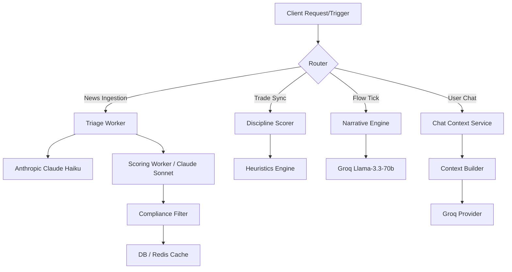
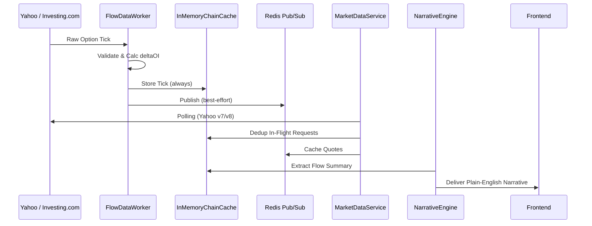

# AI & Option Chain Internal Architecture Documentation

> **Official Engineering Reference**
> **Target Audience:** Principal AI Engineers, Quantitative Trading Engineers, Staff Software Architects.
> **Scope:** AI, Trading Intelligence, Option Chain, Market Data Flow, News Intelligence.

---

## Table of Contents
1. [Project Overview](#1-project-overview)
2. [Complete AI Architecture](#2-complete-ai-architecture)
3. [AI Models](#3-ai-models)
4. [Prompt Engineering](#4-prompt-engineering)
5. [AI Tuning](#5-ai-tuning)
6. [Complete Stock Market Fundamentals](#6-complete-stock-market-fundamentals)
7. [Option Chain Master Guide](#7-option-chain-master-guide)
8. [Open Interest Intelligence](#8-open-interest-intelligence)
9. [Complete Market Data Flow](#9-complete-market-data-flow)
10. [News Intelligence Engine](#10-news-intelligence-engine)
11. [Scraping Architecture](#11-scraping-architecture)
12. [Future Data Strategy](#12-future-data-strategy)
13. [Database Mapping](#13-database-mapping)
14. [Backend Service Mapping](#14-backend-service-mapping)
15. [Security & Reliability](#15-security--reliability)
16. [Future AI & Trading Roadmap](#16-future-ai--trading-roadmap)
17. [Glossary & References](#17-glossary--references)

---

## 1. Project Overview

**Business Objective:**
To provide retail and advanced traders with an institutional-grade trading journal and intelligence platform. The platform tracks trades, calculates discipline scores, monitors real-time market data (Option Chains, Implied Volatility, PCR), and uses AI to distill market news and flow data into actionable, educational insights.

**Trading Problem Solved:**
Traders struggle with cognitive overload from raw data (e.g., millions of open interest contracts, rapid news items) and emotional biases (revenge trading, over-leveraging). 

**Why AI is Required:**
1. **News Triage & Impact Analysis:** AI instantly filters noise and scores regulatory/macro news for directional sector impact.
2. **Behavioral Coaching:** AI acts as a risk manager, identifying execution leaks (e.g., poor R:R, holding losers) from raw trade history.
3. **Narrative Generation:** Translates complex Option Greeks and Open Interest flow into plain-English summaries.

**System Goals:**
- Absolute data integrity via deduplication (e.g., Dhan broker sync).
- Real-time options tick processing with in-memory caching.
- SEBI-compliant AI outputs (Educational Mode only, no direct advisory).

---

## 2. Complete AI Architecture

The AI architecture operates through specialized pipelines rather than a monolithic chatbot.

### AI Workflow & Request Lifecycle

### Context Generation & Prompt Construction
The system builds dynamic context before passing to LLMs:
- **Chat:** `MasterAIContext` pulls `userProfile` (goals, rules), `marketContext` (session phase), `tradeContext` (verified P&L, stats), and `memoryContext` (past warnings).
- **Flow:** `NarrativeEngine` builds a strict, under-400 token JSON summary of pre-computed signals (PCR, Max Pain, ATM IV, Call/Put Walls).

### Response Validation & Output Formatting
- Strict JSON output enforcement via `response_format: { type: 'json_object' }` on Groq.
- The **Compliance Filter** sanitizes outputs. If an AI generates a directional buy/sell recommendation, it is stripped or marked as FAILED.

---

## 3. AI Models

The system implements a multi-provider fallback strategy to balance intelligence, speed, and cost.

| Service | Primary Model | Fallback Model | Provider | Context |
|---|---|---|---|---|
| **News Triage** | `claude-haiku-4-5` | N/A | Anthropic | Fast classification, cheap. |
| **News Scoring** | `claude-sonnet-4-5` | `llama-3.1-8b` | Anthropic / Groq | Deep reasoning for sector impact. |
| **Narrative Engine** | `llama-3.3-70b-versatile` | `llama-3.1-8b` | Groq | Ultra-low latency inference for market ticks. |
| **Chat AI** | `llama-3.3-70b-versatile` | `llama-3.1-8b-instant` | Groq | High-context window for journaling. |

**Usage Strategy:**
- **Anthropic** is reserved for high-stakes intelligence (News Scoring) due to superior reasoning, but with daily USD cost caps built into `ScoringWorker.ts`.
- **Groq** is used for chat and real-time narrative generation due to LPU inference speeds, ensuring 0.5s response times on market ticks.

---

## 4. Prompt Engineering

Prompts are strictly version-controlled within `PromptRegistry.ts` and `ChatPromptRegistry.ts`.

### System Prompts
1. **AI Coach (ChatPromptRegistry):** "You are TradeVault's AI Coach — an institutional-grade trading performance mentor... Respond as a senior prop desk risk manager who has seen thousands of P&L statements."
2. **News Triage (TRIAGE_V1):** "Your task is to classify this news item into three properties: relevant, category, urgency... Mark relevant=true for: RBI decisions, SEBI actions..."
3. **News Scoring (SCORING_V1):** "ABSOLUTE RULES: Do NOT mention specific buy/sell/hold recommendations. Rationale must be ≤200 words, sector-level commentary only."
4. **Narrative Engine:** "You are a financial narrator... ONLY reference numbers present in the provided FlowSummary... Every factual claim must include a [source] citation."

### Hallucination Reduction
- **Data Grounding:** The `NarrativeEngine` is forbidden from analyzing raw chain data. It is fed *pre-computed* signals (`FlowIntelligence`) and translates them.
- **Circuit Breakers:** `ScoringWorker` implements a Circuit Breaker pattern. If models hallucinate or return invalid JSON, the breaker trips to HALF-OPEN/OPEN states.

---

## 5. AI Tuning

Configurations extracted from the provider implementations:

- **Temperature:** `0.1` for Flow Narrative and JSON responses (deterministic). `0.7` for Chat summaries.
- **Top-p:** `0.95` globally.
- **Max Tokens:** Restrained tightly. Flow narrative is capped at `400` in, `250` out. Chat is capped at `800` (reduced from 4096) to prevent artificial rate-limit reservation on Groq.
- **Context Trimming:** Chat limits recent trades to a subset string representation. 
- **Retry Strategy:** `GroqProvider` catches `429 Rate Limit` errors and instantly fails over from 70B to 8B-instant without aborting the stream.

---

## 6. Complete Stock Market Fundamentals

How the platform conceptualizes market structure:

- **NSE / BSE:** The core exchanges. Supported directly via mapping in the broker sync (`dhan.ts`).
- **NIFTY / BANKNIFTY / FINNIFTY:** Tracked indices. NIFTY maps to `^NSEI`, BANKNIFTY to `^NSEBANK` via internal provider IDs.
- **Futures & Options (F&O):** Defined natively in the DB schema. Trades are categorized via `mapInstrumentType()`.
- **Volatility (India VIX):** Tracked in `IvHistory` table. Used to calculate options pricing percentiles.
- **Support / Resistance / VWAP:** **[Future Scope]** Currently, the system focuses on Option Chain derivations (Max Pain, Walls) rather than classical technical charting lines.
- **Risk Management:** Core to the `DisciplineScorer`. Tracks max daily loss, max loss per trade, and allowed trading windows. Violations dock points dynamically.

---

## 7. Option Chain Master Guide

How the system models derivatives:

- **CE / PE:** Call / Put European. Extracted from broker sync (`drvOptionType`).
- **Strike Price & Expiry:** Primary keys alongside symbol for `OiHistory`.
- **ATM / ITM / OTM:** Calculated dynamically in the `FlowDataWorker` and `GreeksEngine` relative to the `spotPrice`.
- **Implied Volatility (IV):** Stored in `IvHistory` (`atmIv`, `ivPercentile`). Compared historically to gauge if premiums are "expensive" or "inexpensive."
- **Open Interest (OI):** The number of active contracts. The system tracks a localized cache (`previousOIMap`) to calculate accurate `changeInOI` (snapshot deltas, not cumulative).
- **PCR (Put-Call Ratio):** Derived by `PCRService`. Used as a primary signal in `FlowIntelligence`.
- **Max Pain:** Calculated by `MaxPainService`. The strike where option sellers experience minimum loss. The AI tracks `maxPainDistPct` to see if spot is gravitating toward it.
- **Call Wall / Put Wall:** The strikes with the highest absolute OI, acting as heavy institutional resistance/support.

---

## 8. Open Interest Intelligence

The platform interprets changes in Price and OI:

| Price Action | OI Action | Interpretation (Implemented via `SignalEngine`) |
|---|---|---|
| Price UP | OI UP | **Long Build-up** (Bullish momentum) |
| Price DOWN | OI UP | **Short Build-up** (Bearish momentum) |
| Price UP | OI DOWN | **Short Covering** (Bearish trend reversing) |
| Price DOWN | OI DOWN | **Long Unwinding** (Bulls exiting) |

These derivations inform the `FlowIntelligence` which calculates a cumulative `agreementScore` (0-100) before passing the bias to the AI Narrator.

---

## 9. Complete Market Data Flow

---

## 10. News Intelligence Engine

**Collection:** Raw news is ingested into `NewsRawItem`. A deduplication hash (`dedupeHash`) built from headline + source + date prevents overlapping logic.
**Triage:** `TriageWorker` evaluates `relevant`, `category`, and `urgency`.
**Scoring:** `ScoringWorker` pushes triaged items to Claude Sonnet to determine `sectorImpact`, `direction`, and `confidence`.
**Compliance Audit:** Every AI action produces an immutable `NewsAuditLog` mapping the exact prompt and exact output to prove compliance.
**Delivery:** Delivered to Redis cache (`news_engine:feed`) to ensure 0ms latency on the frontend.

---

## 11. Scraping Architecture

Providers are implemented in `server/src/market/providers/`:

- **Yahoo Finance (`YahooFinanceProvider.ts`):** 
  - Primary provider. 
  - Uses `v7/finance/spark` and `v8/finance/chart`.
  - Implements Round-robin User-Agent rotation.
  - Implements exponential backoff: 3 fails = 5m timeout, scaling up to 60m to prevent IP bans.
- **Investing.com (`InvestingComProvider.ts`):** 
  - Fallback 2. 
  - Maps custom pair IDs (e.g., NIFTY 50 = 17971).
  - Uses header spoofing (`Referer`, `X-Requested-With`). Highly volatile.
- **MoneyControl (`MoneyControlProvider.ts`):** Fallback 1.

*Note on Anti-Bot:*
Currently handled via UA rotation and backoff. True headless browsers (Playwright) or proxy rotation are **[Future Scope]**.

---

## 12. Future Data Strategy

The current public scraping architecture is a liability for scale. 

| Provider | Suitability | Cost | Limitations | Action Plan |
|---|---|---|---|---|
| **Yahoo / Investing (Current)** | Retail MVP | Free | Unstable, IP bans, Delayed | Replace immediately for Prod |
| **Dhan API (Current Broker)** | Best for Users | Free for clients | Rate limits per user token | Use for authenticated trade syncs |
| **Finnhub** | Excellent News/Fundamentals | $$ | Indian coverage is sometimes spotty | Implement for institutional news |
| **Polygon.io** | Options Data | $$$ | US-centric | Skip for Indian Markets |
| **TrueData / NSE Data Feed** | Institutional Level | $$$$ | Expensive, complex compliance | **Primary Upgrade Path** for accurate ticks |

---

## 13. Database Mapping

Key Prisma Models handling the intelligence logic:

- **`trades` / `strategies` / `broker_connections`:** Core journaling and Dhan integration.
- **`news_raw_items` -> `news_triage` -> `news_impact`:** The News Pipeline.
- **`news_audit_logs`:** Immutable record of LLM inputs/outputs (SEBI compliance).
- **`oi_history` / `iv_history` / `pcr_history`:** Time-series storage for Option Chain calculations.
- **`coach_memory` / `ai_insights` / `ai_conversations`:** Persistent AI contextual memory.
- **`flow_ai_briefs`:** Snapshot narratives generated by the `NarrativeEngine`.

---

## 14. Backend Service Mapping

- **`FlowDataWorker`:** Listens to ticks, calculates `changeInOI`, writes to memory cache.
- **`ScoringWorker` / `TriageWorker`:** Queue-based consumers running Anthropic pipelines.
- **`MarketDataService`:** The central orchestrator routing requests to Yahoo/MoneyControl with stale-cache fallbacks.
- **`AlertEngine`:** Evaluates every option tick against user-defined alerts.
- **`DisciplineScorer`:** Pure heuristic engine running locally to rate trades 1-5 based on slippage, loss sequences, and rule breaking.

---

## 15. Security & Reliability

- **API Key Management:** Provider keys (Groq, Anthropic) are loaded via `.env` strictly server-side.
- **In-Flight Deduplication:** `dedup()` in `MarketDataService` ensures 100 users loading the dashboard simultaneously only trigger 1 Yahoo API call.
- **Stale Cache (`staleCache`):** If Yahoo outright blocks the server IP, the system serves the last-known-good price up to 5 minutes old rather than crashing the UI.
- **Circuit Breakers (`isCbOpen`):** If the AI APIs fail rapidly, the worker opens the circuit, marks items as FAILED, and pauses execution to save loops and budget.
- **Prompt Injection Protection:** The Compliance Filter strips markdown, evaluates the JSON schema, and explicitly checks for restricted terms before saving.

---

## 16. Future AI & Trading Roadmap

**Implemented:**
- AI Coach (Adaptive Intelligence, Discipline Scoring).
- Flow Narrative Engine (Options translating).
- Multi-provider AI fallback (Anthropic -> Groq).
- Broker Sync (Dhan direct API).
- Intelligent Market Data Fallbacks.

**Future Scope:**
- **RAG (Retrieval-Augmented Generation):** Indexing NSE circulars and SEBI guidelines via Vector DB for the AI Coach to reference.
- **Institutional Data Feeds:** Migrating off Yahoo Finance to a leased-line or TrueData websocket for tick-level options data.
- **Multi-Agent AI:** Splitting the AI Coach into distinct agents: A Risk Manager Agent that halts trading, and a Strategy Agent that reviews technical setups.
- **Predictive Analytics / Backtesting:** Measuring AI news impact accuracy via `NewsBacktest` (Session 1, 3, 5 returns).
- **Websockets for UI:** Moving from polling REST endpoints to standard socket.io feeds for the dashboard.

---

## 17. Glossary & References

- **ATM / ITM / OTM:** At-The-Money, In-The-Money, Out-Of-The-Money.
- **Max Pain:** The strike price where option buyers lose the most money (and sellers gain the most).
- **Call/Put Wall:** Highest OI concentration acting as resistance/support.
- **Greeks:** Delta (price sensitivity), Gamma (Delta sensitivity), Theta (time decay), Vega (volatility sensitivity).
- **SEBI:** Securities and Exchange Board of India (regulatory body).
- **Educational Mode:** The strict compliance mode where the AI provides rationale and analogies, but no specific price targets.

> *Auto-generated via System Reverse Engineering. Last Updated: System Default.*
