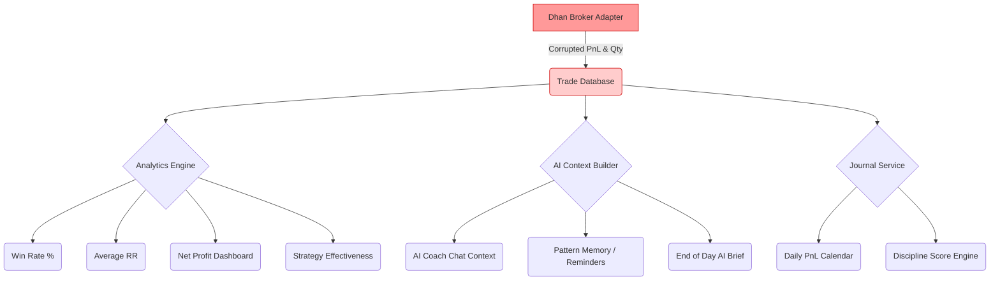

# Dependency Map

This map highlights every downstream system affected by the core PnL calculation bug.

## Blast Radius
1. **Discipline Score:** Punishes users for breaking rules (e.g., max daily loss) because a profitable trade registered as a massive loss.
2. **AI Coach:** Becomes effectively useless if it bases its behavioral analysis on hallucinated losses.
3. **Strategy Effectiveness:** Traders may abandon highly profitable strategies because TradeVault incorrectly tags them with a negative expectancy.
